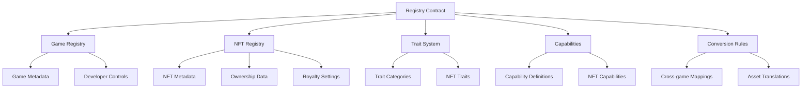

# save-web3: Cross-Platform Asset Registry

A decentralized platform enabling cross-platform digital assets with standardized protocols for metadata and functionality, allowing true digital ownership and seamless asset conversion between different web3 environments.

## Overview

save-web3 enables developers to create interoperable digital assets that work across multiple platforms and virtual ecosystems. The platform provides:

- Centralized registry for cross-platform digital assets
- Standardized metadata and trait system
- Capability definitions for asset functionality
- Asset conversion rules between platforms
- Royalty management for creators
- Flexible permissions system

## Architecture

save-web3 is built around a central registry contract that manages the relationships between platforms, digital assets, and their cross-platform representations.



The system uses several key data structures:
- Games Registry: Stores game metadata and developer information
- NFT Registry: Maintains core NFT data and ownership
- Trait System: Defines and tracks NFT attributes
- Capabilities: Manages what NFTs can do in different environments
- Conversion Rules: Defines how assets translate between games

## Contract Documentation

### asset-registry.clar

This is the core contract managing the save-web3 platform's functionality.

#### Key Functions

**Game Management:**
- `register-game`: Register a new game in the ecosystem
- `update-game`: Modify existing game details
- `get-game`: Retrieve game information
- `get-games-by-developer`: List all games by a developer

**NFT Management:**
- `register-nft`: Create a new NFT in the registry
- `update-nft`: Update NFT metadata
- `get-nft`: Retrieve NFT details
- `is-nft-compatible-with-game`: Check game compatibility

**Trait System:**
- `register-trait-category`: Define new trait types
- `set-nft-trait`: Assign traits to NFTs
- `get-nft-trait`: Retrieve NFT trait values

**Capabilities:**
- `register-capability`: Define new NFT capabilities
- `set-nft-capability`: Configure NFT capabilities
- `get-nft-capability`: Check NFT capabilities

**Conversion Rules:**
- `create-conversion-rule`: Define how NFTs translate between games
- `update-conversion-rule`: Modify conversion rules
- `delete-conversion-rule`: Remove conversion rules

## Getting Started

### Prerequisites
- Clarinet
- Stacks wallet for deployment
- Understanding of NFT standards

### Installation

1. Clone the repository
2. Install dependencies
```bash
clarinet install
```
3. Test the contracts
```bash
clarinet test
```

### Basic Usage

1. Register a game:
```clarity
(contract-call? .asset-registry register-game 
    "platform-123" 
    "My Platform" 
    (some "https://myplatform.com") 
    "Platform description")
```

2. Register an NFT:
```clarity
(contract-call? .asset-registry register-nft
    "asset-123"
    "My Digital Asset"
    "platform-123"
    "https://metadata.url"
    u250) ;; 2.5% royalty
```

3. Create a conversion rule:
```clarity
(contract-call? .asset-registry create-conversion-rule
    "asset-123"
    "target-platform-id"
    "Display Name"
    "https://asset.url"
    "{\"properties\":\"value\"}")
```

## Function Reference

### Game Management

```clarity
(register-game (game-id (string-ascii 50)) 
               (name (string-ascii 100)) 
               (website-url (optional (string-ascii 255))) 
               (description (string-utf8 500)))

(update-game (game-id (string-ascii 50)) 
             (name (string-ascii 100)) 
             (website-url (optional (string-ascii 255))) 
             (description (string-utf8 500))
             (active bool))
```

### NFT Management

```clarity
(register-nft (nft-id (string-ascii 50))
              (name (string-ascii 100))
              (origin-game-id (string-ascii 50))
              (metadata-url (string-ascii 255))
              (royalty-percentage uint))

(update-nft (nft-id (string-ascii 50))
            (name (string-ascii 100))
            (metadata-url (string-ascii 255))
            (royalty-percentage uint)
            (active bool))
```

## Development

### Testing

Run the test suite:
```bash
clarinet test
```

### Local Development

1. Start Clarinet console:
```bash
clarinet console
```

2. Deploy contracts:
```bash
clarinet deploy
```

## Security Considerations

### Permissions
- Contract owner has administrative privileges
- Game developers can manage their own games
- NFT creators can manage their assets
- Conversion rules require proper authorization

### Limitations
- Maximum royalty percentage is 30%
- Game IDs limited to 50 characters
- Maximum 20 games per developer
- Metadata URL length limited to 255 characters

### Best Practices
- Verify authorization before operations
- Validate all input parameters
- Keep metadata URLs permanent
- Follow standardized JSON formats for properties
- Regular security audits recommended